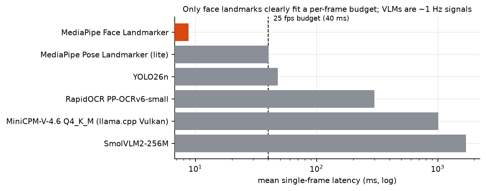

# not_human

Experiments toward a real-time, controllable talking human: speech in, speech and a face out.
Built on a rack of mining-derived GPUs with the tensor cores fused off, which turned out to be
the most instructive part.

**Status: experimental, and most of this repository is measurements, not product.** The voice
loop runs end to end. The face half exists as pieces that were each proven on their own and never
all standing at once. This README tells you which is which, and [`docs/KNOWN_ISSUES.md`](docs/KNOWN_ISSUES.md)
tells you what is broken.

```
 mic ──▶ ASR ──▶ LLM ──▶ TTS ──▶ speakers                       works, in a browser, end to end
          │       └──▶ reaction (blink · gaze · brow · head)      works, measured
          └─ speaker tracking                                     works; two engine bugs fixed on the way
 speech ──▶ lip-synced face ──▶ video track ──▶ browser           pieces work; the last hop is switched off
 camera ──▶ face · pose · detector · small VLM ──▶ context        latency measured; one layer fits a frame
```

## Six results we did not expect

**1. Machine noise doesn't break speech recognition. Another voice does.**
With large-v3-turbo, a siren at −5 dB SNR (louder than the speaker) still reads at 0.04 WER.
Six-talker babble at 0 dB pushes the baseline model past **1.0 WER**, meaning it invents more words
than were said, and leaves even turbo at 0.45. A bigger model cuts that by more than half but
does not fix it.


**2. The recognizer silently deleted the second speaker.** A pause followed by a *different*
voice made the streaming engine drop that voice's entire utterance: not garbled, absent.
It reproduced in batch and streaming, with and without VAD, and did *not* reproduce for the same
speaker across the same gap. The cause was a whisper.cpp anti-hallucination heuristic that
treats a lone trailing timestamp as "silence to the end of the window." A soak test then found
two more bugs (malformed JSON on any transcript containing a quotation mark; no reply to
WebSocket pings, killing sessions every 20–30 s). After the fixes: 307 turns over 30 minutes,
0 timeouts, 0 reconnects. → [01](docs/lab-notebook/01-hearing-stack.md)

**3. Our fix for "startled" blinks made the brows about 7x worse.**
Blinking lifted the eyebrows, so a counter-term was deployed and documented as cancelling it.
Nobody had measured it. Once a landmark-based leakage pipeline existed, worst-case brow leakage
was **0.858** with the "compensation", against **0.117** with full closure and *no* brow term.
The counter-term compounded the lift monotonically across a 0 to −40 sweep. → [02](docs/lab-notebook/02-expression-control.md)

**4. The GPUs weren't slow. They were launching.** The same shape appeared three unrelated times:

| component | what looked slow | what it actually was | fix |
|---|---|---|---|
| YOLO26n | 47.9 ms/frame | 3.0 ms of GPU compute; 94% was dispatch (530 launches/frame) | CUDA graph: **5.65 ms, 8.9x** |
| MuseTalk UNet | 7.4 s of wall time | 1.8 s of kernel time across **19,963 launches** | CUDA graph; 22.2 fps live batches |
| OCR | 250–350 ms | three sequential unbatched calls; a GPU provider changed nothing | fewer calls, not a faster device |

→ [05](docs/lab-notebook/05-dispatch-bound.md)

**5. Several numbers we wrote down were wrong, and we kept the corrections.** A "1.02x realtime"
figure measured the feed pacing, not compute. A claim of "headroom for concurrent sessions" was
false: requests serialize on one mutex and a second process on the same GPU just contends.
"Tensor-core throughput lost to a cuDNN workaround" — there are no working tensor cores.
A baseline WER was attributed to the wrong model in our own compose file. The full list is in
[`KNOWN_ISSUES`](docs/KNOWN_ISSUES.md#findings-we-retracted).

**6. One bug we never solved.** The avatar's audio and video tracks were published, negotiated,
and (server-side) played cleanly, and the browser never subscribed to either. We stopped guessing
and wrote down the next diagnostic step instead. → [06](docs/lab-notebook/06-voice-loop-and-bridge.md)

## What works, and how we know

| piece | status | evidence |
|---|---|---|
| Voice loop (LiveKit agent: STT → LLM → Kokoro TTS, tool-called reactions) | **works** | 147 unit tests; driven through real headless Chrome with a synthetic mic; real audio track played |
| STT service (CrispASR + 5 patches) | **works** on original hardware | large-v3-turbo: **0.066 WER, 14.1x realtime**; ~0.22 s flush-to-final; 30-min soak. Image not rebuilt in this checkout |
| Lip sync (MuseTalk, resident, CUDA-graphed) | **works, below target** | 22.2 fps on 4-frame live batches; **15.4 fps** steady on the long run; native 25 not reached |
| Expression control (LivePortrait bank + MediaPipe feedback) | **works, measured** | 306 samples, 0 failures; envelopes per control; bit-deterministic renders |
| Perception (face / pose / detector / VLM) | **measured** | face fits a frame (~8 ms); pose borderline (40 ms); everything else is a 1 Hz signal |
| Avatar video over LiveKit | **off** | memory-leak fix written, not confirmed live; browser never rendered the tracks |
| Audio-to-video talking head (LTX-2.3) | explored, no code | ~197 s warm per clip; lip sync never established by a metric → [04](docs/lab-notebook/04-audio-to-video-ltx.md) |
| Control contracts (`spec/`) | **specified, tested** | 190 tests; the adapters and compositor were never built |
| Whole-body avatar (IDOL / SMPL-X) | not included | license-gated; see `NOTICE` |



The expression bank at work (wink · surprise-wink · kiss · smile · nod; silent renders, deliberately
subtle): more in [`media/`](media/).


## Layout

```
voice-agent/   LiveKit agent: phrase streaming, reactions, Kokoro plugin, vision client (147 tests)
stack/         the service stack: MuseTalk resident, LivePortrait bank, MediaPipe feedback,
               affect classifier, vision sidecar, web demo, docker-compose, controllability tools
  crispasr-stt/  Dockerfile + one patch against a pinned upstream commit (no vendored source)
speech/eval/   the adversarial ASR harness and its recorded results
spec/          typed, deterministic control contracts with tests and ADRs
docs/lab-notebook/   six write-ups: what we tried, the numbers, what failed
media/         preset-voice audio + STT round-trip scores, expression clips, one A2V sample
tools/         figure generation, demo-audio generator, round-trip scorer; a proof-of-concept avatar-identity prompt director (LLM draft →
               fail-closed checker → image endpoint; needs a compatible generation service)
data/, figures/
```

## Run something (no GPU needed)

```bash
# control contracts
(cd spec && PYTHONPATH=src python -m pytest tests)                      # 190 tests

# the voice agent (dependencies come from the lockfile)
(cd voice-agent && uv sync --frozen && uv run python -m pytest tests)   # 147 tests

# service-stack unit tests
(cd stack && python -m pytest tests)                                    # 111 pass, 22 skipped

# regenerate every figure from the recorded result files
python tools/make_figures.py
```

The GPU stack is `stack/docker-compose.yml`. It needs model weights you fetch yourself, a CUDA
host, and a lot of goodwill: the original deployment pinned seven services to specific cards.
Two images were rebuilt from scratch for this release, started and exercised; **the rest of the
stack and the composed system were not re-run** ([details](docs/KNOWN_ISSUES.md)). To reproduce the ASR results you need a running CrispASR server; see
[`speech/eval/`](speech/eval/) (`CRISPASR_BIN`, and the corpus downloads itself).

### Container images

The two images that are safe to publish (MIT code plus NVIDIA CUDA runtime; no weights) are on
GitHub Container Registry, private for now:

```bash
echo $GH_TOKEN | docker login ghcr.io -u <you> --password-stdin        # needs read:packages
docker run --gpus device=0 -p 8097:8097 -v /path/to/models:/models:ro \
  ghcr.io/jajmangold/not_human-crispasr-stt:0.1.0      # needs /models/ggml-large-v3-turbo.bin
docker run --gpus device=0 -p 8080:8080 -v /path/to/lfm2vl:/models:ro \
  ghcr.io/jajmangold/not_human-lfm2vl:0.1.0            # needs the LFM2.5-VL GGUF + mmproj (LFM1.0 license)
```

Or build them yourself: `docker build stack/crispasr-stt` clones upstream at a pinned commit and
applies the patch (~11 min on 48 cores). The ALP and vision images are not published; see `NOTICE`.

## The lab notebook

| | |
|---|---|
| [01 hearing stack](docs/lab-notebook/01-hearing-stack.md) | noise, overlap, rooms, five engine fixes, soak, model choice, what we retracted |
| [02 expression control](docs/lab-notebook/02-expression-control.md) | who owns which degree of freedom; the leakage pipeline; the 0.858 → 0.117 story |
| [03 perception](docs/lab-notebook/03-perception-latency.md) | what fits in 40 ms; profiling; what didn't batch; the model swap |
| [04 audio-to-video](docs/lab-notebook/04-audio-to-video-ltx.md) | generating the whole clip from a WAV; frame-rate drift; a metric that never went positive |
| [05 dispatch-bound](docs/lab-notebook/05-dispatch-bound.md) | the hardware, and the one bottleneck that kept reappearing |
| [06 voice loop & bridge](docs/lab-notebook/06-voice-loop-and-bridge.md) | what runs, the bugs worth writing down, the one still open |

## About the hardware

The GPUs are NVIDIA CMP 100-210 cards: GV100 (Volta, sm_70) mining silicon, several flashed with a
V100 VBIOS so `nvidia-smi` calls them V100s. FP16/TF32 tensor cores are firmware-disabled
(**6.9 TFLOP/s on that path, slower than the 8.3 TFLOP/s FP32 path**), so the working assumption
is plain FP32 and `dp4a`. Stock recent PyTorch has dropped sm_70 entirely, so the images pin
CUDA 12.6 builds. Most of the engineering in here is a response to that, and much of it is
hardware-specific. The ideas (measure leakage, count launches, soak the stream) are not.

## Provenance and what's left out

History is fresh: this was assembled from several internal repositories, and the commit history
was not carried over. Left out on purpose: model weights and datasets; anything derived from real
people (including personal photographs used during development); a face-swap dataset built on
real people's photos; and an unrelated interview-assistant project. Media is in
[`media/`](media/): audio synthesized from this repo's own scripts with preset voices, expression
clips of three portraits **the owner vouches are AI-generated** (an attestation, not a record; the
source images are not included), and one audio-to-video sample. Other face clips were held back
because their sources are real people or untraceable ([`KNOWN_ISSUES`](docs/KNOWN_ISSUES.md#media)).

## License

MIT for the code written here ([`LICENSE`](LICENSE)). It does not cover the third-party code,
models and datasets this depends on, and some of those are not permissive. Checked against
upstream: two services pull in AGPL-3.0 `ultralytics`, the LivePortrait path loads
non-commercial-research InsightFace models and an unlicensed ComfyUI node, and one VLM family uses
a non-OSS license. The license of the Advanced LivePortrait node is unknown to us (upstream states none). The full
table is in [`NOTICE`](NOTICE); the caveats are in [`docs/KNOWN_ISSUES.md`](docs/KNOWN_ISSUES.md).
