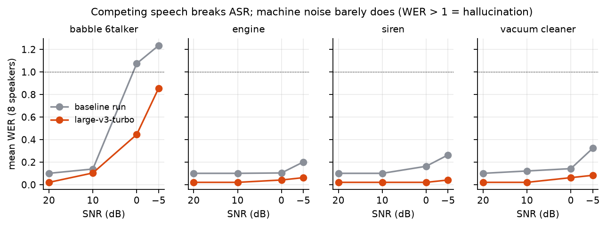
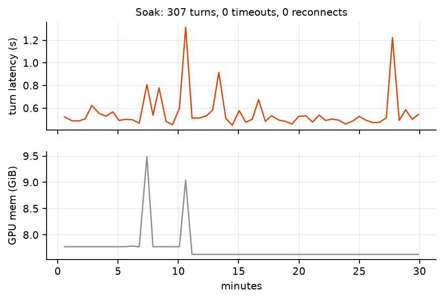
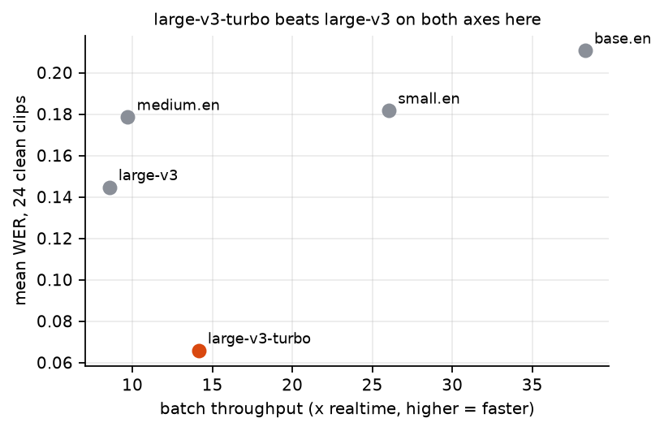

# 01 · The hearing stack: an adversarial evaluation of streaming ASR

*Speech recognition is the input to everything else. We tried to break it first.*

Harness: [`speech/eval/`](../../speech/eval/) · Raw results: [`speech/eval/results/`](../../speech/eval/results/) ·
Regenerate plots: `python tools/make_figures.py`

The engine under test is [CrispASR](https://github.com/CrispStrobe/CrispASR), a whisper.cpp fork
(one C++/ggml binary, many ASR backends, an OpenAI-compatible HTTP server, a WebSocket streamer).
Ground truth is LibriSpeech test-clean (real transcripts, real speaker IDs) and ESC-50 noise.
The corpus is fetched at run time (`fetch_corpus.py`); no audio is stored in this repo.

Scale caveat up front: the baseline noise sweep is **8 speakers**, the model comparison is
**24 clips**. These are diagnostic numbers, not benchmark-grade ones.

## What held up

**Machine noise is a non-problem; other people talking is the whole problem.**

Engine, siren and vacuum noise degrade WER gracefully even at -5 dB SNR (louder than the speech).
Six-talker babble (a proxy for a TV in the room) collapses: WER above 1.0 means the model emits
more wrong words than the reference contains. It is hallucinating. Bigger models help
(large-v3-turbo roughly halves babble WER at 0 dB) but do not fix it.

**Person-tracking across interleaved turns works** (4 real speakers, turns A B C A D B, 0.5 s
gaps): every speaker's non-adjacent turns land on the same cluster, zero cross-speaker collisions.

**Rooms are mostly fine, one is not.** Convolving speech with nine real recorded room impulse
responses (MIT IR survey) against large-v3-turbo:

| room | mean WER | vs. dry (0.021) |
|---|---:|---:|
| bathroom | 0.000 | – |
| outdoor amphitheater | 0.018 | ~0 |
| bedroom | 0.035 | +0.014 |
| office (large, brick) | 0.038 | +0.017 |
| parking lot / stairwell | 0.070 | +0.049 |
| gym | 0.112 | +0.091 |
| large living room | 0.174 | +0.153 |
| **school hallway** | **0.355** | **+0.334** |

Long, hard-surfaced spaces are a real weak point that additive-noise testing alone never shows.
(9 rooms, one impulse response each.)

## What broke, and what it turned out to be

The first verdict was "not a clean pass": **a silence gap followed by a different speaker's voice
silently deleted the second speaker's entire utterance.** Not misattributed — absent. Isolation
was a chain of controlled A/B runs:

- reproduces with no diarization flag at all (so: not a diarization bug)
- reproduces with VAD enabled (VAD is not a fix)
- does **not** reproduce for the *same* speaker across the same gap (so: not "any silence")
- reproduces identically with digital-zero silence and a realistic noise floor
- reproduces identically in batch and in real-time streaming, including a genuine barge-in

That is exactly the shape of ordinary conversation, which is why it was disqualifying.

**Root cause** (in code inherited from upstream whisper.cpp, not CrispASR-specific): a "single
timestamp ending" heuristic treats a lone unpaired trailing timestamp as "confirmed silence to the
end of the 30 s window" and skips the rest of the chunk. It is a deliberate anti-hallucination
measure. The same token pattern also fires when a new speaker starts right after a pause.
**Fix:** take the whole-chunk skip only when `no_speech_prob` agrees it's silence.
Genuine trailing silence still comes out `[BLANK_AUDIO]`.

A side effect worth noting: the "streaming falls behind real time" finding mostly vanished
(13.38 s to finalize 12.73 s of paced audio, versus ~1.5x behind before). The stall was a symptom
of the model repeatedly confusing itself on this exact pattern, not a separate performance bug.

**Second bug: diarization always found one speaker.** For fewer than 4 embeddable segments the
speaker-count estimator returned `k = min_k` *without ever computing a similarity*. Debug output:
`n_emb=2 -> k=1 (too_few_samples, cos_p10=0.0000)`, while the true cosine similarity was -0.07
(clearly two people). Fix: a direct pairwise-cosine check for `n < 4`. Exact for n=2; for n=3 it
can only detect "more than one," not resolve a 3-way split.

**A soak test found two more.** One persistent WebSocket, real clips looped with a `flush`
between turns — a test shape nothing earlier had used:

1. Any transcript containing a literal `"` produced malformed JSON (raw text `snprintf`'d into a
   string literal, under a comment claiming it was escaped), including on the `final` event, so
   it never arrived in parseable form. Quoted dialogue is common in read-aloud text.
2. The server never answered WebSocket pings. Standards-compliant clients force-close after enough
   unanswered pings: a working session died with a 1011 "keepalive ping timeout" every 20–30 s.

All five fixes are in [`stack/crispasr-stt/patches/`](../../stack/crispasr-stt/patches/) as one net
patch against a pinned upstream commit. **None has been sent upstream**, and none has a
CrispASR-native regression test; they were verified only by the harness in this repo.

*307 turns over 30 minutes, 0 timeouts, 0 reconnects (latency sampled every ~6th turn, 54
points). GPU memory sits at 7.8–8.0 GiB with two isolated spikes (to 9.5 and 9.0 GiB) that
return to baseline on the next sample. We attribute them to other tenants on the shared GPU —
plausible, since that card was independently seen being claimed by other jobs, but not proven.*

## Retractions

Two findings from the first pass did not survive re-examination, and are recorded here because
that is the point of a lab notebook:

- **"Finalization inconsistency"** (final text shorter than a preceding partial): an artifact of the
  *test script truncating the displayed text to 70–80 characters.* Not a CrispASR bug.
- **"Named-speaker identification never fires":** the test script grepped for `speaker_db`; the
  log line says `speaker-db`. Enrollment worked (`cluster 0 -> 'Alice' (cos 0.89)`). The
  filter, not the engine, was wrong.

## Speed: the lever was architecture

Every early latency number re-spawned the CLI per test, paying ~2 s of model load each time.
Against a persistent server, the interruption scenario finalized about **0.22 s** after the
client sent `flush` (the number that matters for turn-taking). A protocol trap found by reading
`ws_stream.cpp` rather than trusting the docs: `{"final": true}` fires **only** in response to a
client text frame containing the literal `"flush"`. Without it the stream just goes quiet.

An earlier "1.02x realtime" figure was measuring feed pacing (audio was fed at wall-clock speed),
not compute. Batch throughput is the honest number.

## Model choice

| model | mean WER (24 clean clips) | batch throughput |
|---|---:|---:|
| base.en | 0.211 | 38.3x realtime |
| small.en | 0.182 | 26.0x |
| medium.en | 0.179 | 9.7x |
| **large-v3-turbo** | **0.066** | **14.1x** |
| large-v3 | 0.145 | 8.6x |

large-v3-turbo beating full large-v3 on accuracy is surprising and **unexplained here**. It keeps
the large encoder with a 4-layer distilled decoder, which explains the speed but not the WER.
With 24 clips from one corpus we would not bet on the ordering of the top two.

## Concurrency: a claim we had to retract

An early note said the service had "headroom for concurrent sessions." Measured:

- Within one server process requests **serialize on a single model mutex**: wall time scales
  linearly with concurrent requests, aggregate throughput stays flat (~11–13x realtime).
- Two server processes on one GPU **contend for compute** rather than adding parallelism:
  each ran ~2x slower than solo; combined throughput (9.0x) was no better than one process.

The capacity of a card is its single-stream throughput ceiling (roughly 9–14x realtime), not a
multiple of it.

## Crosstalk: called unfixable, then fixed

Above ~50% overlap the engine does not blend two speakers badly. It picks one and **silently
discards the other.** Putting a 2-speaker separation model
([SepFormer](https://huggingface.co/speechbrain/sepformer-wsj02mix)) in front recovers both at
80% and 100% overlap (~30x realtime, so it's cheap). Two honest caveats:

- At low overlap (0–30%) separation *adds* transcription noise (the model was trained on
  near-fully-overlapped mixtures). It must be gated behind an overlap signal (the diarization
  segment-count collapse is one). **The gate is documented but not implemented.**
- The checkpoint is fixed at two sources; a third simultaneous speaker will not separate.

`speech/eval/crisp_separate_and_transcribe.py` is the working component. It is wired into nothing.

## One artifact worth a second look

In the raw results for the clean baseline, one clip's hypothesis ends with `Thank you.` that is
not in the audio. Whisper-family models hallucinate a closing pleasantry over trailing silence.
Anything that commits transcript text should energy-check the segment's span before believing it.
