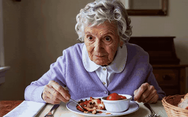

# 04 · Audio-to-video: driving a whole talking clip from a WAV

*The road we did not take to the end. Included because the failure modes are the useful part.*

There is **no code from this experiment in the repo**. It ran on a video-generation model
(LTX-2.3, 22B, Q3 GGUF) inside a separate production pipeline. What follows are the measurements
and findings we could trace to the original issue threads, not a runnable recipe.

The approach is the inverse of MuseTalk. MuseTalk paints a mouth onto an existing face video from
audio. Here a large audio-video diffusion model generates the *entire clip* (face, head, body,
scene) conditioned on a still image and a real speech WAV.

One production-pipeline output, shown silent here ([▶ with sound](https://jajmangold.github.io/not_human/#a2v)). It illustrates the
approach; it is **not** evidence that the lip sync worked.

## What the recipe had to be

Conditions that turned out to be load-bearing:

- **Native 512×320.** A non-native resolution misaligned the audio VAE.
- **Real TTS WAV** encoded and attached as audio-reference tokens; the *original WAV is muxed
  back* into the final file. Decoding the model's own audio latent produced garbage:
  high-frequency energy (>4 kHz) collapsed 0.025 → 0.001, RMS inflated 0.21 → 0.37, and the
  duration stretched from 3.02 s to 5.04 s.
- **Frame rate matters more than it looks.** The audio VAE runs at ~25 latents/s; generating at
  24 fps gives ~4% cumulative drift. That matches the "gets worse toward the end" of longer clips
  and was identified as a likely root cause of lip drift. Video must be at least as long as the
  audio, in 8n+1 frames.

## Late-clip melt: a decoder accumulation bug

Quality degraded toward the end of clips. The cause was **causal-VAE decode accumulation error**.
Overlap-chunked causal decode plus bookend keyframe conditioning moved a 3-point judge severity
score from `[3, 6, 8]` (early, mid, late) to `[2, 4, 5]`, the first "usable for rough cut"
verdict. This is a small qualitative judge score, not a benchmark.

## A memory bug that only shows up under a mask

Fractional guide strength introduces an attention mask, which forces a fallback path that
materialized a **2.39 GB** attention-score matrix (121 frames, 768×512, 32 heads, 6,144 tokens)
and ran out of memory next to a resident model. An exact query-chunked attention fixed it at
about 13% overhead.

## Timings

On the fleet's Volta-class cards, the locked recipe measured **~333 s cold, ~197 s warm** per
clip, with peak HBM around **13.7 GB** (~120 s denoise plus ~77 s VAE decode). An earlier
interim service had run about **1,635 s cold and 1,549 s "warm"** (roughly 26 minutes per clip),
because the full stack could not co-reside on a 16 GB card and everything, dominated by a 46 GB
checkpoint parse, reloaded on every run. The notes call it a "warm timing myth." "Warm" was not
warm until the model was resident.

## A lip-sync metric that never turned positive

The one automated lip-sync check, a correlation between mouth motion and the audio envelope,
read **−0.09** for the single-pass recipe and **−0.16** for a two-pass redub, "worse than
chance." Whether a correlation proxy is even the
right instrument for this is unresolved here. **Lip-sync quality was never established by a
measurement we can point to.** Treat this as an unresolved result rather than a success or a
failure.

## What happened next

The project's later planning moved to a different model path. We have not traced the reasoning
behind that decision and do not characterize it.

## Why this page exists

The interesting content is the failure surface of joint audio-video generation: the model's
audio is *generated*, so an external WAV has to be frozen and re-muxed; frame rate must match
the audio VAE's latent rate; and late-clip degradation came from the decode step rather than from denoising. Those constraints would
apply to any similar system.
