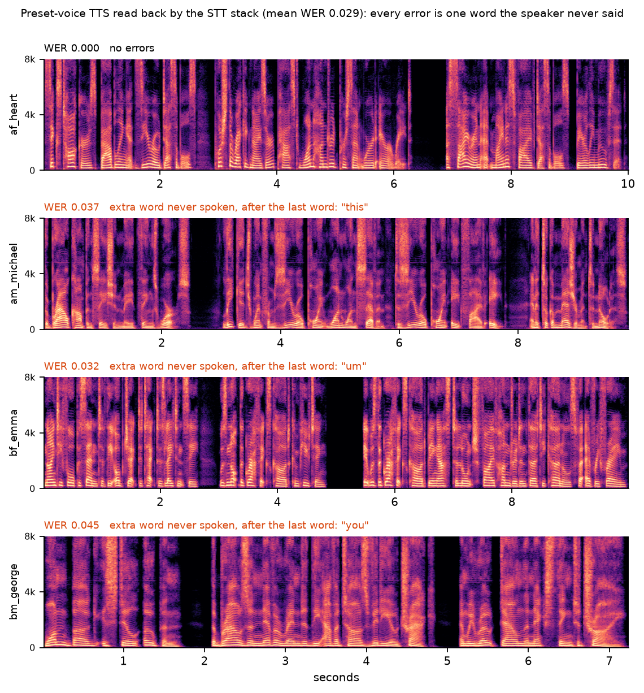

# media/

Everything here is generated from this repository's own scripts, so its provenance is known by
construction. Nothing is derived from a real person's face or voice.

## audio/

Four lines synthesized with Kokoro **preset** voices (`af_heart`, `am_michael`, `bf_emma`,
`bm_george`): no cloning, no reference recordings. `manifest.json` records each clip's voice,
text, and the SHA-256 of the model and voice files. Regenerate with
`tools/make_demo_audio.py`.

`roundtrip.json` is those clips read back by the STT stack (CrispASR, large-v3-turbo, one
GPU) and scored with the same WER function as `speech/eval/`. STT digits are spelled out before
scoring (`100%` → "one hundred percent") so number style is not counted as an error; nothing
else is edited.

**Result: mean WER 0.029 over 4 clips, 0 content errors.** Every error is a single extra word
the speaker never said at the very end (`this`, `um`, `you`), in 3 of the 4 clips. It is
consistent with the trailing-pleasantry hallucination described in
[lab-notebook/01](../docs/lab-notebook/01-hearing-stack.md), but this run did not isolate the
cause. n = 4 short clips: an illustration, not a benchmark.

Voices: Kokoro-82M is Apache-2.0 (see [NOTICE](../NOTICE)).
