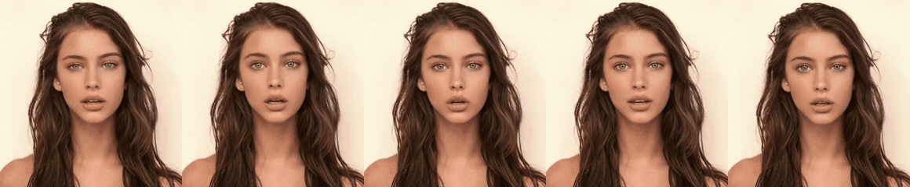
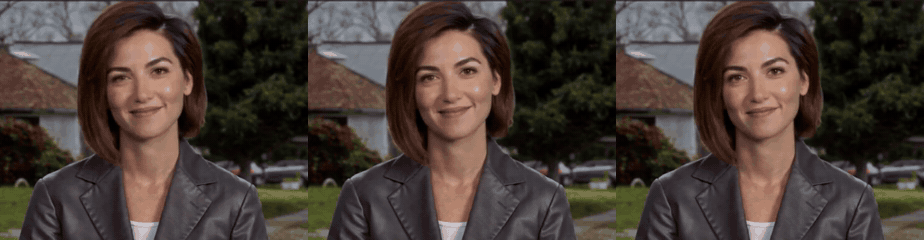

# media/

Everything here is generated from this repository's own scripts, so its provenance is known by
construction. Nothing is derived from a real person's face or voice.

## audio/

Four lines synthesized with Kokoro **preset** voices (`af_heart`, `am_michael`, `bf_emma`,
`bm_george`): no cloning, no reference recordings. `manifest.json` records each clip's voice,
text, and the SHA-256 of the model and voice files. Regenerate with
`tools/make_demo_audio.py`.

`roundtrip.json` is those clips read back by the STT stack (CrispASR, large-v3-turbo, one
GPU) and scored with the same WER function as `speech/eval/`. STT digits are spelled out before
scoring (`100%` → "one hundred percent") so number style is not counted as an error; nothing
else is edited.

**Result: mean WER 0.029 over 4 clips, 0 content errors.** Every error is a single extra word
the speaker never said at the very end (`this`, `um`, `you`), in 3 of the 4 clips. It is
consistent with the trailing-pleasantry hallucination described in
[lab-notebook/01](../docs/lab-notebook/01-hearing-stack.md), but this run did not isolate the
cause. n = 4 short clips: an illustration, not a benchmark.

Voices: Kokoro-82M is Apache-2.0 (see [NOTICE](../NOTICE)).

## video/

**Expression renders** (`video/expressions/`, 13 silent clips, 286 KB total): the ALP expression
bank driving three portraits: wink, surprise-wink, kiss, smile, nod, idle. They are subtle on
purpose; reaction strength is capped (see lab-notebook 02). Bank versions differ per clip (`v9`
to `v13`, and an older 8 fps `v2` set) and are recorded in `manifest.json` with each source
filename. Full-height previews:

| Portrait A | Portrait C | Portrait B |
|---|---|---|
|  |  |  |

*(each preview: wink · surprise-wink · kiss · smile · nod, left to right; B shows wink · smile · idle)*

The three source portraits are **AI-generated according to the repository owner, who vouched for
them on 2026-09-24**. The repo holds no generation record for them, so this is an attestation, not
something the files can prove, and the source images are deliberately not included.

**`video/ltx-a2v-dinner-scene.mp4`** (2.1 s, 512x320, 24 fps, with audio) is a production-pipeline
output of the audio-to-video approach in [lab-notebook 04](../docs/lab-notebook/04-audio-to-video-ltx.md):
an AI-generated dinner scene whose characters come from text prompts, with a synthetic voice. It
is included as an illustration of that approach, **not as evidence that its lip sync worked**
(that was never established; see the notebook). It was made with LTX-2.3 under the LTX-2 Community
License: the licensor claims no rights in the output, a use policy applies, and entities with
$10M+ annual revenue need a separate commercial license ([NOTICE](../NOTICE)).
